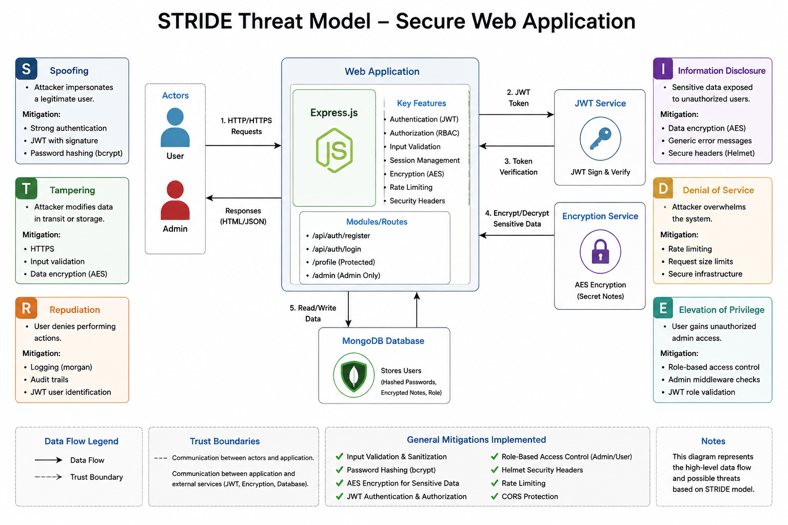

# STRIDE Threat Modeling Report

## Application Name
Secure Web Application – Application Security Project

---

## System Overview
This application is a secure web system that supports:
- User registration and login
- Role-based access control (Admin/User)
- Protected API routes
- Encrypted sensitive data
- JWT-based authentication

---

## STRIDE Threat Analysis

| Threat Category | Description | Potential Impact | Mitigation |
|----------------|-------------|------------------|------------|
| Spoofing | Attacker impersonates a user using stolen credentials or JWT token | Unauthorized access to accounts | JWT authentication, bcrypt password hashing |
| Tampering | Modifying requests or database data via API manipulation | Data corruption or unauthorized changes | Input validation, HTTPS, Mongoose schema validation |
| Repudiation | User denies performing actions (login, update, delete) | Lack of accountability | Logging with morgan, timestamps |
| Information Disclosure | Exposure of sensitive data like passwords or secret notes | Privacy breach | AES encryption, password hashing, secure headers (Helmet) |
| Denial of Service | Flooding server with requests or brute force attacks | Server slowdown or crash | Rate limiting (express-rate-limit), request throttling |
| Elevation of Privilege | Normal user accesses admin-only routes | Unauthorized admin access | RBAC + adminMiddleware |

---

## STRIDE Implementation Mapping

### S - Spoofing
- JWT authentication
- bcrypt password hashing

### T - Tampering
- validator.js input validation
- Mongoose schema validation

### R - Repudiation
- morgan logging middleware
- request tracking

### I - Information Disclosure
- AES encryption for secret notes
- Helmet + CSP headers

### D - Denial of Service
- express-rate-limit (100 requests / 15 min)
- CORS restrictions

### E - Elevation of Privilege
- Role-based access control (RBAC)
- adminMiddleware protection

---

## STRIDE Data Flow (Simple Diagram)

User → Login → JWT Token → Middleware → Role Check → Response

## STRIDE Diagram

